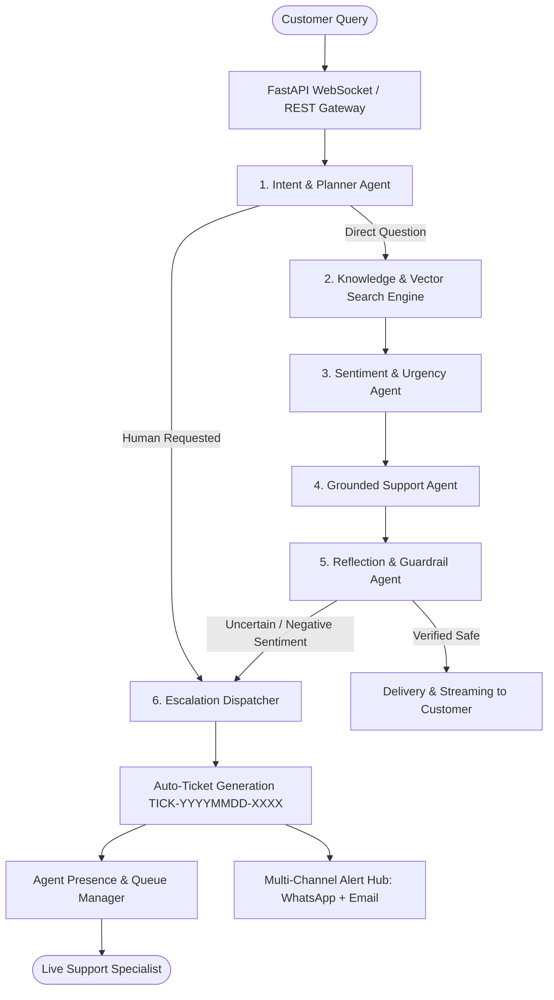

  

  <strong>Enterprise Multi-Agent AI Customer Support & Live Specialist Escalation Platform</strong>

  
  
  
  
  
  

---

## 🌟 Executive Summary

**Copilot Support** is a mission-critical, enterprise-grade AI customer support platform designed for high-concurrency environments. Powered by a **LangGraph multi-agent cognitive engine**, **Supabase `pgvector` RAG**, **FastAPI microservices**, and a **Next.js 16 App Router** frontend, the system orchestrates automated multi-channel resolutions while providing seamless real-time handoff to live human support specialists.

---

## 🏛️ Cognitive Multi-Agent Architecture (LangGraph)

The platform utilizes a cyclical multi-agent graph with deterministic guardrails and fast-path routing:

### Agent Roles & Responsibilities

1. **Planner Agent**: Performs zero-shot intent categorization (`factual_query`, `billing_inquiry`, `troubleshooting`, `escalation_request`).
2. **Knowledge & Vector Search Agent**: Queries Supabase `pgvector` HNSW indexes using 1536-dimensional embeddings with cosine similarity thresholds.
3. **Sentiment & Urgency Agent**: Evaluates customer sentiment (`positive`, `neutral`, `concerned`, `frustrated`, `urgent`) to dynamically adjust response tone and calculate SLA risk.
4. **Support Synthesizer Agent**: Generates structured, grounded responses containing verifiable source citations and actionable next steps.
5. **Reflection & Guardrail Agent**: Validates responses against hallucination benchmarks, safety policies, and confidence thresholds before dispatch.
6. **Escalation Dispatcher**: Handles state transitions from AI to human specialists, generates tracking tickets, and alerts on-call agents.

---

## 🖥️ Four-Tier Role Separation & Workspaces

The platform enforces strict role-based access control (RBAC) across four specialized workspaces:

### 1. 👤 Client Support Portal (`/customer/chat`, `/customer/tickets`)
- **Conversational Grounding**: Real-time AI chat with clickable source citations, markdown formatting, and interactive prompt suggestions.
- **One-Click Human Assistance**: Explicit *"Talk to Human"* escalation triggers with live specialist status banners.
- **Ticket Lifecycle Tracker**: Comprehensive ticket status tracking (`open`, `in_progress`, `escalated`, `resolved`, `closed`) with full conversation history.

### 2. 🎧 Specialist Command Center (`/agent`)
- **Real-Time Escalation Queue**: Live WebSocket queue with wait-time tracking, customer sentiment indicators, and priority badges.
- **Claim & Resolve Workflow**: One-click session claiming, bidirectional messaging, and instant queue eviction upon resolution.
- **Agent Presence Heartbeat**: Automated online/away presence tracking with idle heartbeat synchronization.
- **AI Suggested Replies**: LangGraph-generated draft responses for rapid specialist review and injection.

### 3. 📊 Operations Management Cockpit (`/manager`, `/manager/escalations`, `/manager/team`, `/manager/reports`)
- **SLA Telemetry**: Real-time first-response time (FRT), resolution rates, and escalation distribution analytics.
- **Workload Balancing**: Specialist capacity utilization metrics and active ticket assignment oversight.
- **Team Administration**: Specialist provisioning, role assignments, and performance monitoring.

### 4. ⚙️ Root Admin & Knowledge Engine (`/admin`, `/admin/agents`, `/admin/notifications`, `/admin/whatsapp`)
- **Vector Knowledge Base Ingestion**: Multi-document ingestion pipeline with automated chunking, overlap control, and pgvector embedding generation.
- **Omnichannel Dispatch Config**: WhatsApp Business Cloud API webhooks, Gmail SMTP credentials, and routing matrix management.
- **Audit & Telemetry**: Full-system request telemetry, trace visualization, and error logging.

---

## 📱 Omnichannel Notification & Alerting Hub

The system delivers real-time notifications across multiple communication streams:

- **WhatsApp Cloud API (Meta)**: Direct WhatsApp alerts to customers and on-call support specialists with customizable message templates.
- **Gmail SMTP Engine**: Automated email alerts for ticket creations, specialist assignments, internal notes, and resolution summaries.
- **In-App Notification Bell**: Real-time badge counter, push alert toggling, and sound notification controls.
- **WebSockets / Server-Sent Events**: Sub-millisecond bidirectional event delivery between customers and agents.

---

## 🎨 Design System & Visual Aesthetics

- **Curated Color Palette**: Seamlessly integrated **Cyan (`#06B6D4`) to Deep Navy (`#1E3A8A`)** gradient with **Midnight Slate (`#0E2A47`)** text surfaces.
- **VIP SaaS Elevation**: Micro-borders, frosted glass blurs (`backdrop-blur-md`), ambient cyan glow meshes, and interactive elevation cards.
- **Spotlight Command Palette**: Universal `Ctrl + K` / `Cmd + K` navigation for instant search and shortcut execution across all portals.
- **Responsive Typography**: Engineered with Google Fonts *Plus Jakarta Sans* (body), *Outfit* (headings), and *JetBrains Mono* (code/telemetry).

---

## 🛠️ Complete Technology Stack

| Layer | Technology | Description |
|---|---|---|
| **Frontend Framework** | Next.js 16 (App Router), React 19, TypeScript 5.x | High-performance, server-rendered and client-hydrated UI |
| **Styling & Design System** | Tailwind CSS v4, Custom CSS Design Tokens | Cyan/Navy gradient design system with micro-animations |
| **State Management** | Zustand | Client-side reactive stores for chat, auth, and notifications |
| **Backend Gateway** | FastAPI, Python 3.11+, Uvicorn | Async REST API and WebSocket gateway |
| **AI Multi-Agent Graph** | LangGraph, LangChain, Groq LLM API (`llama-3.3-70b`) | Cognitive orchestration, intent classification, and reflection |
| **Vector Database** | Supabase PostgreSQL with `pgvector` extension | 1536-dim vector embeddings with cosine similarity HNSW index |
| **Authentication & RBAC** | Supabase Auth (JWT) | Multi-role token verification, claims validation, and memory cache |
| **Event Messaging** | WebSockets, Redis (Pub/Sub Fallback), Apache Kafka | Real-time bidirectional message and event streaming |
| **External Integrations** | Meta WhatsApp Cloud API, Gmail SMTP | Omnichannel notifications and escalation dispatch |
| **Telemetry & Tracing** | OpenTelemetry, Prometheus Metrics | Distributed tracing, request duration metrics, and health telemetry |

---

## 🔒 Security, Compliance & Resiliency

- **Row-Level Security (RLS)**: Enforced across all Supabase database tables to isolate customer data.
- **Circuit Breaker Pattern**: Non-blocking Redis connection manager preventing event-loop hangs during external service disruptions.
- **Stateless JWT Validation**: Multi-tier token validation with in-memory caching for sub-millisecond route authorization.
- **Hallucination Guardrails**: Automated confidence scoring and reflection filters on every AI-generated response.

---

## 📜 License

Distributed under the **MIT License**. See `LICENSE` for more information.

&copy; 2026 **Copilot Support Enterprise**. All rights reserved.
